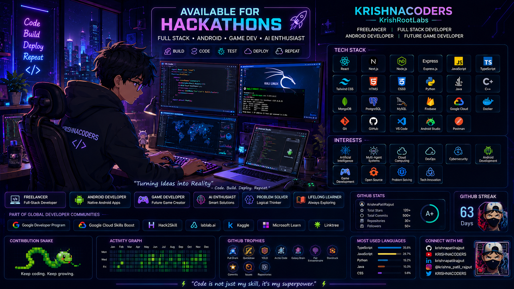

<!-- ✨ Animated Banner ✨ -->

 

<table align="center" border="0">
<tr>
<td width="38%" align="center" valign="middle">

<!-- 🪪 Swinging Lanyard ID Card -->

</td>
<td width="62%" valign="middle">

### 🎥 Freelance Showcase

A quick look at how I work as a freelance developer — from idea to shipped product.

| ⚡ What I Build | 🛠️ Stack |
| :--- | :--- |
| Responsive web apps | `React.js` `Next.js` `Tailwind CSS` |
| Native Android apps | `Java` `Android Studio` |
| AI-powered products | `Python` `Node.js` `Firebase` |
| Full-stack systems | `Express.js` `MongoDB` `PostgreSQL` |

 

> 💙 *"I don't just write code — I ship products."*

</td>
</tr>
</table>

 

## 👨‍💻 About Me

I'm **Krishna Patil Rajput** — a **Freelance Full-Stack Web Developer**, **Native Android Developer**, and **AI Enthusiast**, currently a 3rd-year IT Engineering student at **Matoshri College of Engineering, Nashik**. I build under the brand **KRISHNACODERS**, focused on clean architecture, intuitive UX, and performance-driven products across Web, Android, and AI.

- 🚀 **Focus:** React.js / Next.js web apps, native Android apps, and AI-powered products.
- 🌱 **Learning:** Cloud Computing, DevOps, Cybersecurity, Multi-Agent AI Systems, and the Godot Engine.
- 🎯 **Mission:** Build innovative products, collaborate globally, and keep pushing what's possible with software.
- 🗺️ **My Journey:** [From school to Engineering →](./journey.md)

 

## 🛠️ Tech Stack

 

## 🌐 Learning Platforms & Communities

| Platform | Profile |
| :--- | :--- |
| 🟦 **Google Developer Program** | [View Profile](https://me.developers.google.com/u/krishna-patil-rajput) |
| ☁️ **Google Cloud Skills Boost** | [View Profile](https://www.skills.google/public_profiles/9556852e-a998-4fbf-9a27-23c3ec7a97e4) |
| 🚀 **Hack2Skill** | [View Profile](https://hack2skill.com/dashboard/user_public_profile/?userId=6985d138d9155d4c3659a9e1&utm_source=hack2skill&utm_medium=homepage) |
| 🤖 **lablab.ai** | [View Profile](https://lablab.ai/u/@krishna_patil_rajput) |
| 📊 **Kaggle** | [View Profile](https://www.kaggle.com/krishnapatilrajput) |
| 🟣 **Microsoft Learn** | [View Profile](https://learn.microsoft.com/en-us/users/krishnapatilrajput-1391/) |

 

### 📊 GitHub Stats & Graphs

  

  

<!-- 📈 Contribution Activity Graph -->

  

<!-- 🏆 Trophies -->

  

### 🐍 Watch the snake eat my contributions

  

### 📫 Let's Connect

  

  

*⭐️ Curiosity wrote my first line of code — consistency will write the rest.* 💙

