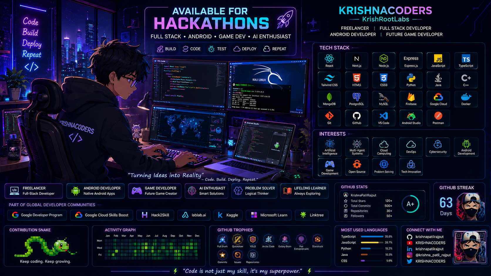
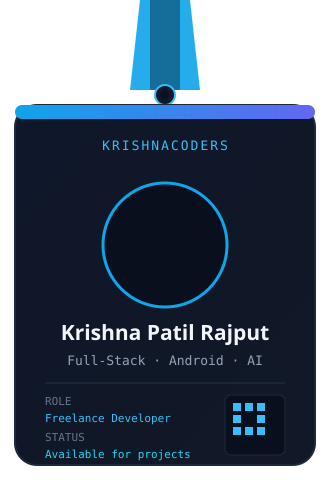

<!-- ========================================================================= -->
<!--          KRISHNACODERS (Krishna67890) // KALI LINUX TERMINAL MATRIX       -->
<!-- ========================================================================= -->

  <!-- LOCAL REPOSITORY BANNER WITH FALLBACK -->
  

    

  <!-- TERMINAL TYPING SIMULATOR -->
  

    
  

  <!-- CYBER HUD STATUS BADGES -->
  

    
    
    
    
  

<!-- ========================================================================= -->
<!--                    KALI TERMINAL IDENTITY & LANYARD                       -->
<!-- ========================================================================= -->

<table width="100%" border="0" cellspacing="0" cellpadding="0">
  <tr>
    <td width="60%" valign="top">
      

        <h3 style="color: #00FF66;"><code>root@krishnacoders:~# cat /etc/identity.conf</code></h3>
        <pre style="background: #0D1117; color: #00FF66; padding: 10px; border: 1px solid #00FF66; border-radius: 6px;">
[OPERATIVE]     : Krishna Patil Rajput (Krishna67890)
[CLASS]         : 3rd Year (TY) IT Engineering Student
[LOCATION]      : Matoshri COE, Nashik, Maharashtra, IN 🇮🇳
[PRIMARY_STACK] : MERN / Next.js / Vite / GSAP / Web Speech API
[CYBER_OPS]     : Kali Linux, Nmap, Wireshark, Metasploit, Bash, Python
[AI_CORE]       : Vertex AI, Gemini API, RAG Architecture, Agents
[GAME_PHYSICS]  : Godot Engine, 3D BlockCraft, Custom Drift Engines</pre>
        
<b>Mission:</b> Developing secure, highly animated web systems, autonomous decision intelligence tools, and native Android applications with a hacker mindset.

      

    </td>
    <td width="40%" valign="top" align="center">
      <!-- REPOSITORY LANYARD / BADGE ASSET -->
      
    </td>
  </tr>
</table>

 

<!-- ========================================================================= -->
<!--                 KALI LINUX & CYBERSECURITY SKILLS MATRIX                  -->
<!-- ========================================================================= -->

<h2 align="center" style="color: #00FF66;">🐉 Offensive Security & Cyber Arsenal</h2>

### 🛡️ Cyber Security & Penetration Testing

### 💻 Full-Stack Development & Web Animation

### 🧠 Artificial Intelligence & Cloud Security

 

<!-- ========================================================================= -->
<!--                      FEATURED DEPLOYMENT SHOWCASE                         -->
<!-- ========================================================================= -->

<h2 align="center" style="color: #00F0FF;">⚡ Deployed Target Matrix & Exploits</h2>

<table width="100%" cellspacing="10" cellpadding="10">
  <tr>
    <td width="50%" bgcolor="#0D1117" style="border: 1px solid #00FF66; border-radius: 8px;">
      <h3 align="center" style="color: #00FF66;">🤖 Smart Community AI</h3>
      
<b>Decision Intelligence Suite</b> built for Gen AI Academy APAC Edition to analyze municipal infrastructure and public safety data.

      

        <a href="https://krishnablogy.blogspot.com/2026/07/smart-community-ai.html"><code style="color: #00FF66;">[ Read System Logs ]</code></a>
      

    </td>
    <td width="50%" bgcolor="#0D1117" style="border: 1px solid #00F0FF; border-radius: 8px;">
      <h3 align="center" style="color: #00F0FF;">🗳️ Democracy Lens AI</h3>
      
<b>Hack2Skill Winner Project:</b> Generative AI mentor for voter intelligence, policy evaluation, and candidate tracking.

      

        <a href="https://krishnablogy.blogspot.com/2026/04/democracy-lens-ai-election-mentor.html"><code style="color: #00F0FF;">[ View Winner Record ]</code></a>
      

    </td>
  </tr>
  <tr>
    <td width="50%" bgcolor="#0D1117" style="border: 1px solid #FF0055; border-radius: 8px;">
      <h3 align="center" style="color: #FF0055;">⚔️ ArenaMindAI & UrbanMind</h3>
      
FIFA World Cup 2026 Virtual PromptWars challenge arena + Kaggle AI Capstone urban simulation project.

      

        <a href="https://www.youtube.com/embed/HRLPRi5-Se4"><code>[ Arena Demo ]</code></a> | 
        <a href="https://www.youtube.com/embed/zlT6qAyaO9Y"><code>[ Urban Demo ]</code></a>
      

    </td>
    <td width="50%" bgcolor="#0D1117" style="border: 1px solid #FFD700; border-radius: 8px;">
      <h3 align="center" style="color: #FFD700;">🧱 Minecraft BlockQuest & Drift</h3>
      
Interactive 3D browser block-building sandbox paired with high-velocity vehicle drift racing physics.

      

        <a href="https://krishnablogy.blogspot.com/2026/04/block-parkour.html"><code>[ Play BlockQuest ]</code></a> | 
        <a href="https://krishnablogy.blogspot.com/2026/04/vertigo-drift-rage-obstacle-course.html"><code>[ Play Drift ]</code></a>
      

    </td>
  </tr>
</table>

 

<!-- ========================================================================= -->
<!--                    AUTONOMOUS SNAKE & TECHNICAL STATS                     -->
<!-- ========================================================================= -->

<h2 align="center" style="color: #00FF66;">🐍 Contribution Attack Surface</h2>

  <picture>
    <source media="(prefers-color-scheme: dark)" srcset="https://raw.githubusercontent.com/Krishna67890/Krishna67890/output/github-contribution-grid-snake-dark.svg">
    <source media="(prefers-color-scheme: light)" srcset="https://raw.githubusercontent.com/Krishna67890/Krishna67890/output/github-contribution-grid-snake.svg">
    
  </picture>

 

<!-- ========================================================================= -->
<!--                         LANGUAGE MATRIX & STREAKS                         -->
<!-- ========================================================================= -->

<table width="100%">
  <tr>
    <td width="50%" align="center">
      
    </td>
    <td width="50%" align="center">
      
    </td>
  </tr>
</table>

 

<!-- ========================================================================= -->
<!--                               FOOTER CTA                                  -->
<!-- ========================================================================= -->

  
  
<b><code>root@krishnacoders:~# echo "Designed & Engineered by Krishna Patil Rajput"</code></b>

  
<small>© 2026 KRISHNACODERS • Transitioned to 3rd Year IT Engineering</small>

